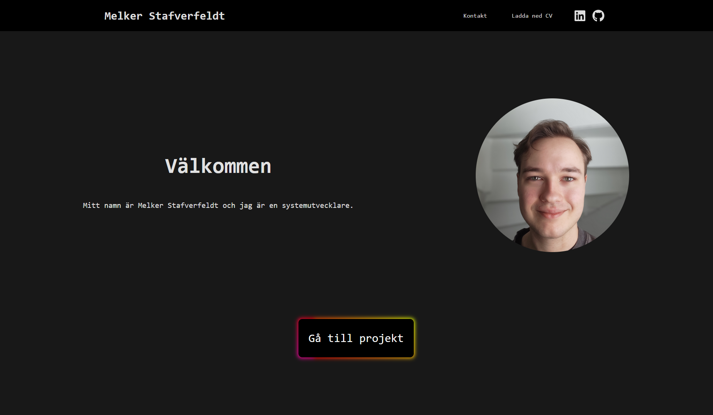

# Portfolio Website 💼 

Check out at mellenker.se



## Tech Stack

**Frontend**: React

**Backend**: Node, Express, SQLite

## Build it yourself
### Prerequisites
* Node.js v24.11.1 (recommended)
* npm
### Steps
1. Install frontend dependencies:
```
cd frontend
npm install
```
2. Build frontend:
```
npm run build
```
3. Install backend dependencies:
```
cd ../backend
npm install
```
4. Start the server:
```
node server
```
5. Open your browser and visit:
```
http://localhost:3000
```
You should now see the app running locally.

## Future feature ideas
* English language support
* Client for modifying database

